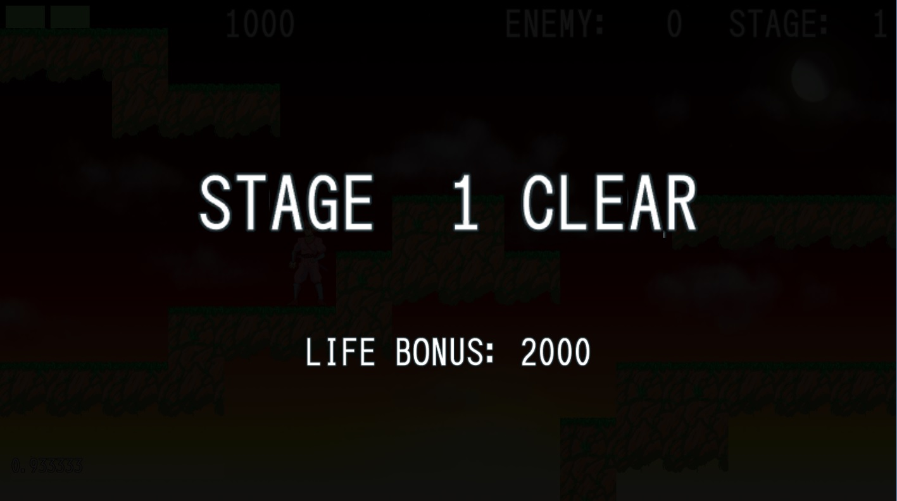
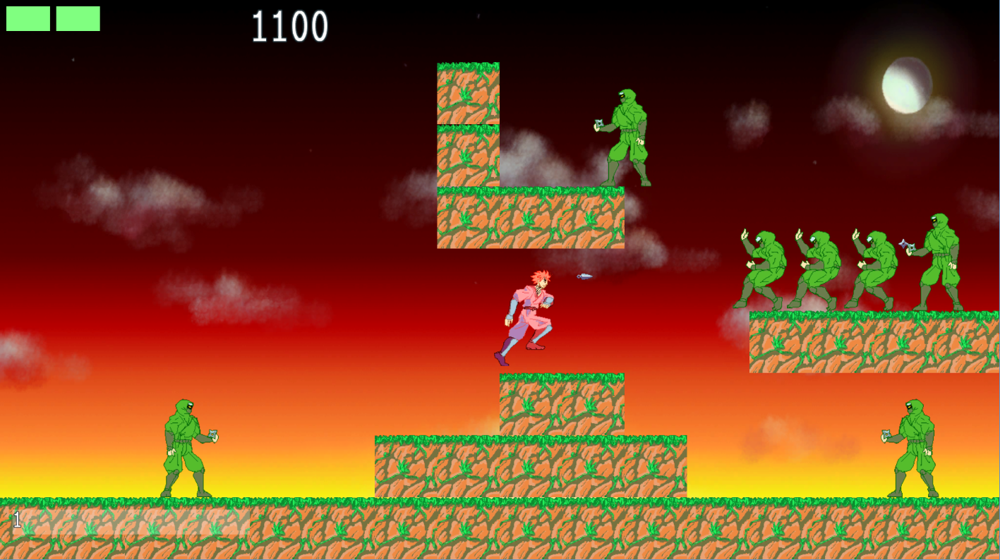

kuin_action_game
================

side view action game using Kuin

#version 0.3.2
* Implement level clear scene.
* Implement updating level difficulty.

#version 0.3.1
* Add Map chip.

#version 0.3.0
* Enemies just entered dose not collide with player.
* Player can fire to upper and lower.
* Increase map size(2x1 to 2x2 screen). and change level design.
* Renew camera control algorithm.
* Animate player shot and enemy shot.

#version 0.2.0
* Implement playing the sound effect.
* Fix: fix enemy attack area for player on the left side.

#version 0.1.5
* Implement enemy damage motion.
* Add actor collision activation flag.

#version 0.1.4
* Replace Font rendering code.
* Implement performance counter.

#version 0.1.3
* Fix v0.12 bug.

#version 0.1.2
* Implement animation.
* Draw backgroud.
* Bug: it has the memory access violation sometimes.

#version 0.1.1
* Implement texture.

#version 0.1
* Implement simple terrain(white).
* Implement simple game play.
* Implement Player(red), Enemy(green), Shot(purple).

