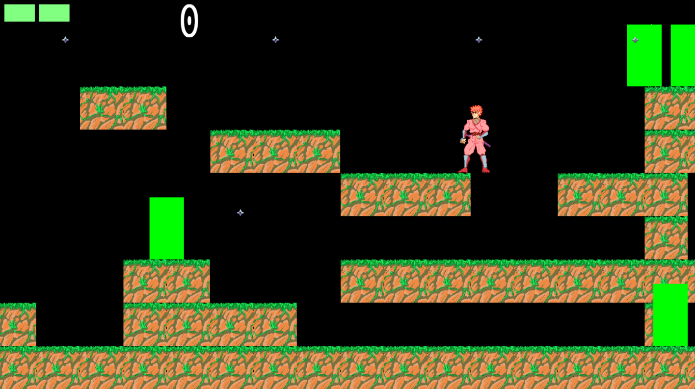

kuin_action_game
================

side view action game using Kuin

#version 0.1.5
* Implement enemy damage motion.
* Add actor collision activation flag.

#version 0.1.4
* Replace Font rendering code.
* Implement performance counter.

#version 0.1.3
* Fix v0.12 bug.

#version 0.1.2
* Implement animation.
* Draw backgroud.
* Bug: it has the memory access violation sometimes.

#version 0.1.1
* Implement texture.

#version 0.1
* Implement simple terrain(white).
* Implement simple game play.
* Implement Player(red), Enemy(green), Shot(purple).

